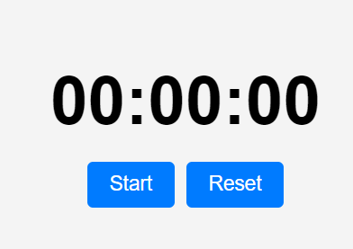

# Stopwatch App

This is a simple stopwatch application built using **HTML**, **CSS**, and **JavaScript**. The stopwatch displays the time in **Minutes:Seconds:Milliseconds** format and includes start, stop, and reset functionalities.

## Features

- **Start/Stop** button to toggle the stopwatch between running and paused.
- **Reset** button to reset the stopwatch back to `00:00:000`.
- Displays the time in **Minutes:Seconds:Milliseconds** format.
- Uses `setInterval` for updating the time at every 10 milliseconds.

## Project Structure

